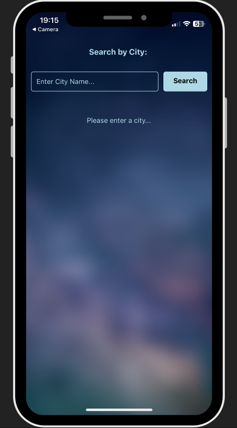

# Mobile Weather App

A mobile weather app built with React Native and Expo, providing real-time weather information using the OpenWeather API and location services via the Google Geomapping API. The app features a user-friendly interface designed using Figma.

## Features

- Get current weather conditions for any location worldwide.
- Display temperature, weather description, and location details.
- User-friendly interface designed in Figma.

## Technologies I Used

- React Native
- Expo
- OpenWeather API
- Google Geomapping API
- Figma

## Screenshots
<div style="justify-content: center;">
  
  
</div>

## Installation

1. Clone the repository:

```bash
git clone https://github.com/alessandro-001/WeatherAppMobile.git
cd your-weather-app
```

2. Configure API keys:

You'll need API keys from OpenWeather and Google. You will need them for your project's configuration:
- Go to: https://openweathermap.org to create an account (if you don't have one), generate your own API key and choose the current weather data free plan.
- Go to: https://developers.google.com/maps/documentation/geocoding/overview to generate yout Geocoding API key, (account needed) 
- In the root of the project create the .env file and store your keys there (API_KEY and GOOGLE_KEY)

3. Install dependencies:
```bash
npm install
```

4. Start Expo:
```bash
npx expo start
```

## Usage
- Launch the app on your device or emulator.
- Enter a city name or allow location access to fetch weather data automatically.
- View the current weather conditions for the chosen location.

## Acknowledgements
- Openweather for API key
- Google Geomapping for the API key
- Figma for UI interface prototyping


